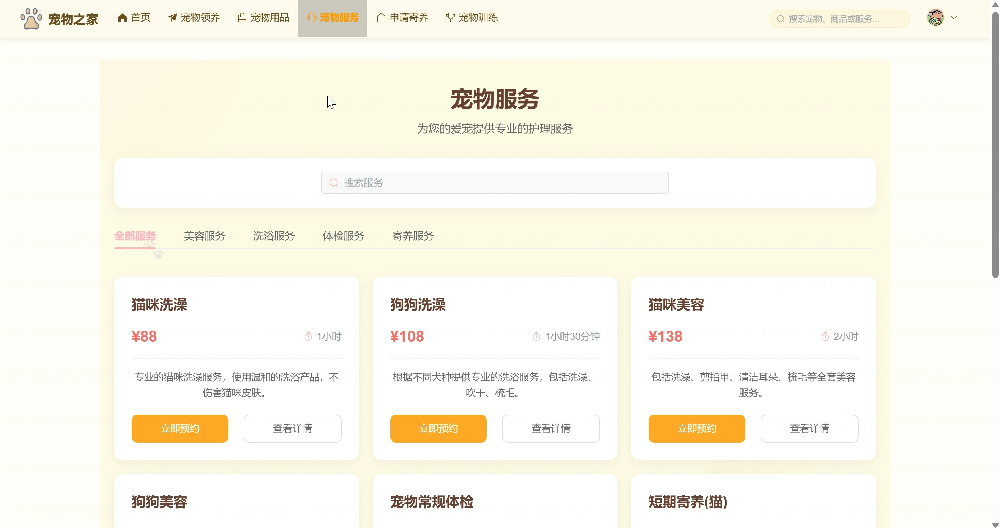
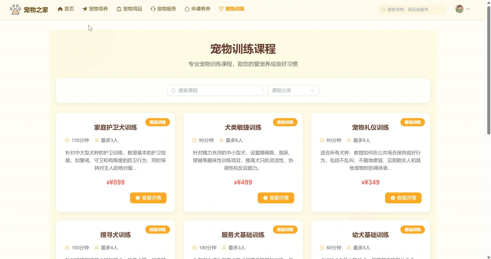
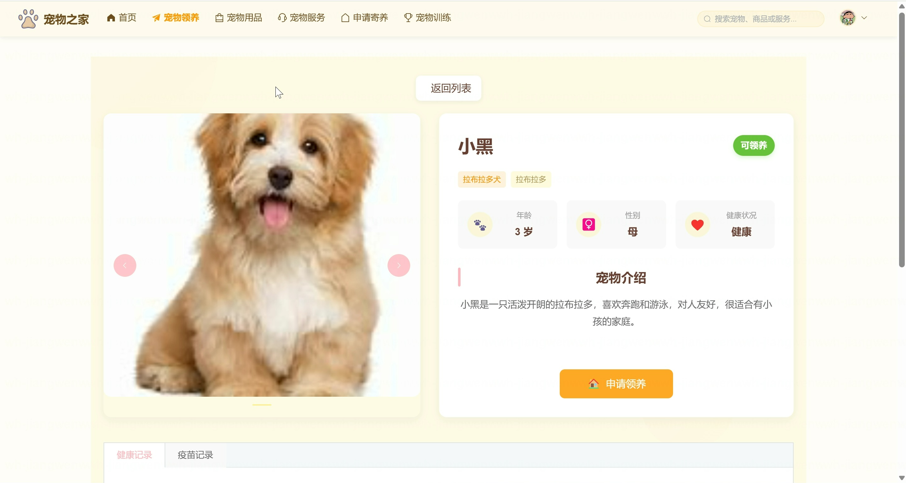
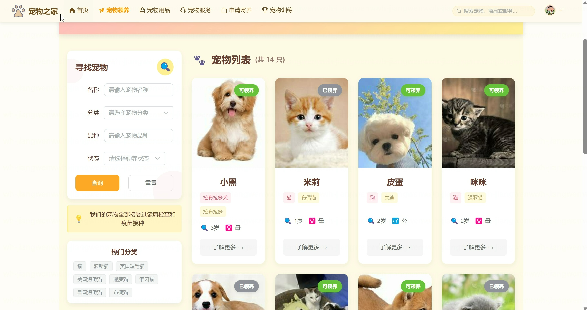
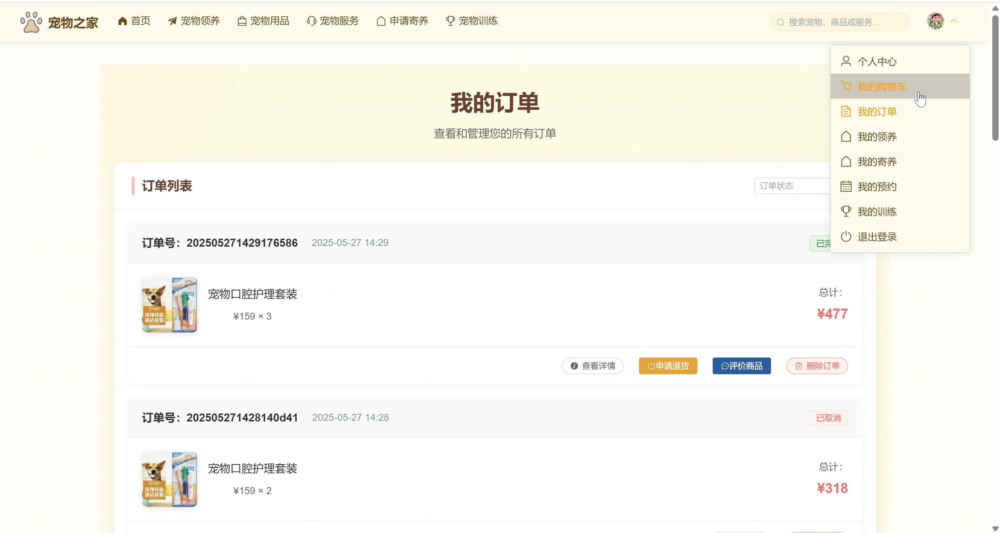
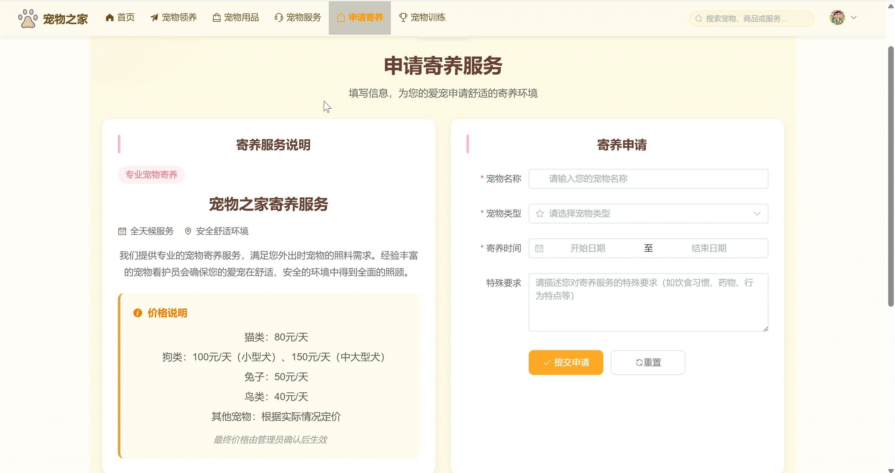
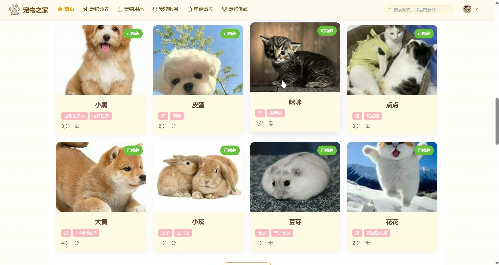
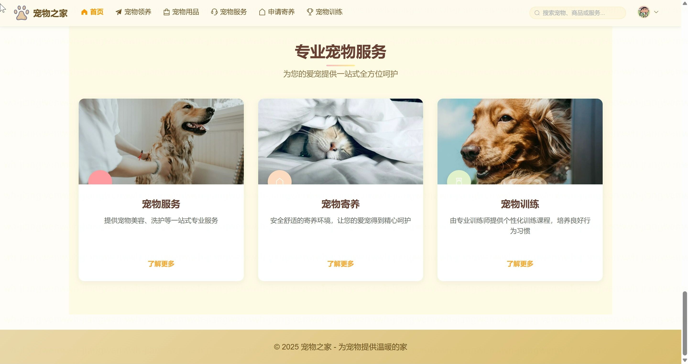
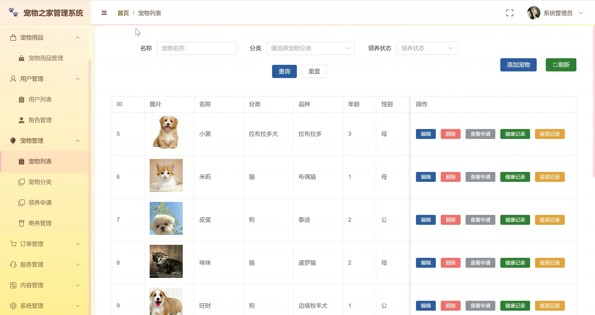
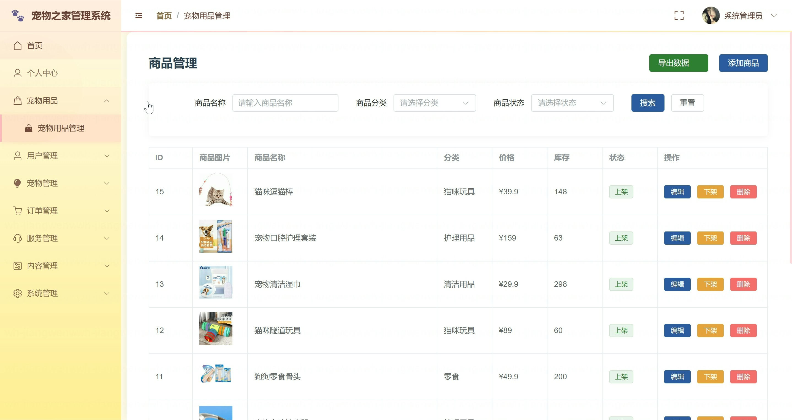

<h1 align="center">基于SpringBoot的宠物管理系统</h1>

- <b>完整代码获取地址：从戎源码网 ([https://armycodes.com/](https://armycodes.com/))</b>
- <b>技术探讨、资料分享，请加QQ群：692619798</b>
- <b>作者微信：19941326836  QQ：3645296857</b>
- <b>承接计算机毕业设计、Java毕业设计、Python毕业设计、深度学习、机器学习</b>
- <b>选题+开题报告+任务书+程序定制+安装调试+论文+答辩ppt 一条龙服务</b>
- <b>所有选题地址 ([https://github.com/Descartes007/allProject](https://github.com/Descartes007/allProject)) </b>

## 一、项目介绍

基于SpringBoot的宠物管理系统，系统角色为管理员（后台）和普通用户（前台），主要功能如下：
### 管理员（后台）：
- 基本操作：登录、修改密码、获取/修改个人信息
- 用户管理：分页/筛选用户、查看用户详情、新增/删除/禁用用户
- 角色与权限管理：新增/修改/删除角色、查看角色权限、动态菜单管理（按角色下发菜单）
- 菜单管理：新增/编辑/删除菜单、菜单列表
- 仪表盘与统计：用户/订单/预约/课程等统计展示
- 宠物管理：宠物列表/详情/新增/更新/删除、分类管理
- 领养管理：查看领养申请、审批领养、领养记录管理
- 寄养管理：寄养申请审核、寄养记录管理
- 服务与预约管理：服务分类、服务项目管理、预约查看与管理（含批量操作）
- 训练课程管理：课程与课程分类的 CRUD、预约管理与审批
- 商品与订单管理：商品上下架、库存管理、订单查询与处理
- 轮播/公告管理：轮播图 CRUD、公告发布
- 健康档案/寄养记录：宠物健康记录与寄养历史管理
### 普通用户（前台）：
- 账号体系：注册、登录、个人资料查看/修改、修改密码
- 浏览与检索：首页轮播、公告、搜索、宠物列表与详情、商品列表与详情、课程列表
- 领养功能：提交领养申请、查看我的领养状态
- 寄养服务：提交寄养申请、查看我的寄养记录
- 服务预约：预约服务（美容、寄养等）、我的预约查看
- 训练课程：报名/预约课程、查看我的课程与预约
- 购物与订单：加入购物车、下单、查看订单状态

## 二、项目技术

- 编程语言：后端 Java；前端 JavaScript（Vue 3）
- 项目架构：B/S 前后端分离
- 前端技术：，Vue 3 + vue-router，Pinia ，Element Plus，axios
- 后端技术：Spring Boot，Spring Security + JWT（JwtTokenUtils），MyBatis-Plus，，Swagger/OpenAPI

## 三、运行环境

- JDK版本：17
- 操作系统：Windows7/10、MacOS
- 开发工具：IDEA、Ecplise、MyEclipse都可以

## 四、数据库配置文件

- npm版本：6.14.13及以上都可以
- Redis版本：3.2.100及以上都可以
- 文件名：application.properties
- 编码类型：utf8

## 论文截图

## 系统截图

